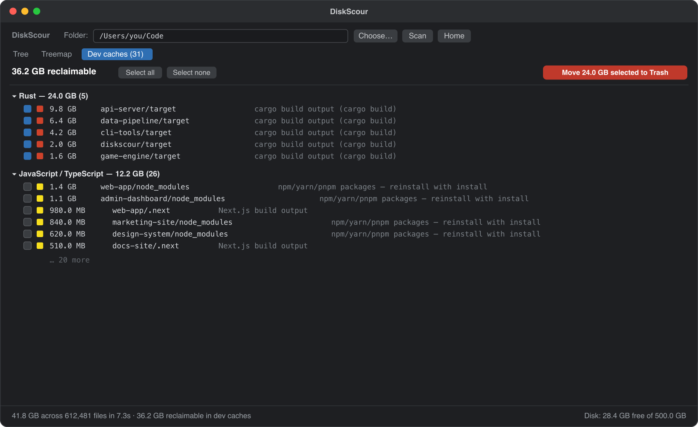
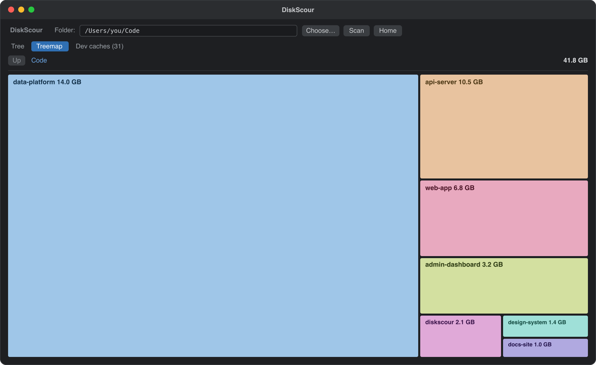

<p align="center">
  
</p>

<h1 align="center">DiskScour</h1>

<p align="center">A fast, native macOS disk analyzer that finds — and reclaims — the gigabytes of build junk on your dev machine.</p>

---

## The problem

Your disk fills up and you have no idea where it went. On a dev machine the answer is
almost always **regenerable build caches** — `node_modules`, Rust `target/`, `.next`,
`DerivedData`, `.gradle` — scattered across dozens of projects and git worktrees. They
add up to tens of gigabytes you can delete and recreate any time, but Finder won't show
you that, and `du` won't tell you which ones are safe to nuke.

**DiskScour scans a folder in seconds, shows you exactly what's eating the space, and lets
you move the regenerable caches to the Trash in one click.**

## Demo

Point it at a folder and it tells you how much is reclaimable — here, **59.8 GB of 62.3 GB**
is just build caches, grouped by ecosystem and safe to delete:



Browse what's actually there as a tree (sorted biggest-first) or a treemap — click to drill
in, hover for details:



> Caches are matched in context (a `target/` only counts next to a `Cargo.toml`, etc.) and
> nested caches are de-duplicated, so the "reclaimable" number is honest. Selected items go
> to the **macOS Trash** — recoverable, never a hard delete, always behind a confirmation.

## Run it

Needs a [Rust toolchain](https://rustup.rs).

```sh
git clone https://github.com/pathorsAI/diskscour
cd diskscour
cargo run --release
```

Prefer a double-clickable app in your dock? Build `DiskScour.app`:

```sh
cargo install cargo-bundle --locked
cargo bundle --release   # → target/release/bundle/osx/DiskScour.app
```

### Terminal one-liner

No window, just the numbers:

```sh
diskscour scan ~/Github
```

## License

MIT © Pathors
