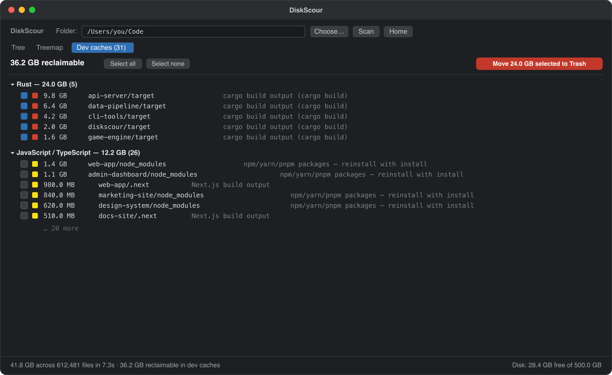
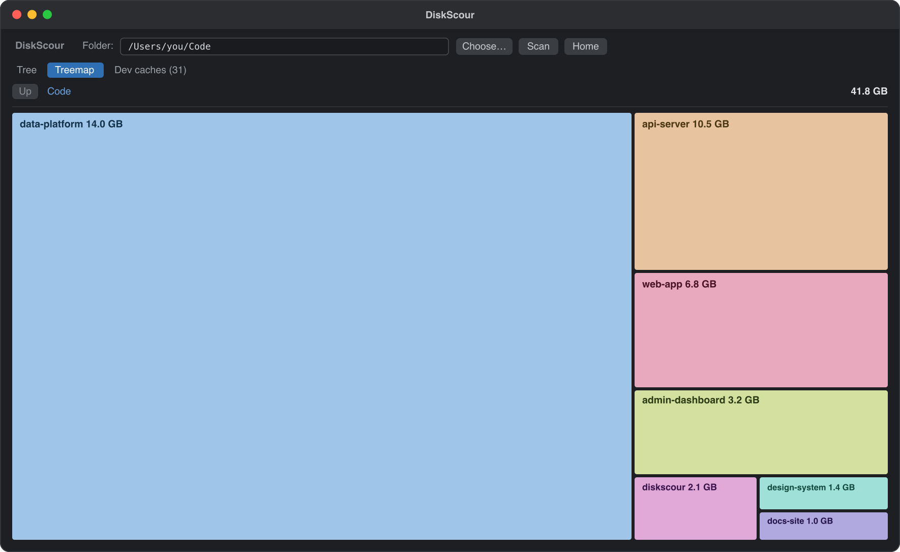

<p align="center">
  
</p>

<h1 align="center">DiskScour</h1>

<p align="center">A fast, native macOS disk analyzer that finds — and reclaims — the gigabytes of build junk on your dev machine.</p>

---

## The problem

Your disk fills up and you have no idea where it went. On a dev machine the answer is
almost always **regenerable build caches** — `node_modules`, Rust `target/`, `.next`,
`DerivedData`, `.gradle` — scattered across dozens of projects and git worktrees. They
add up to tens of gigabytes you can delete and recreate any time, but Finder won't show
you that, and `du` won't tell you which ones are safe to nuke.

**DiskScour scans a folder in seconds, shows you exactly what's eating the space, and lets
you move the regenerable caches to the Trash in one click.**

## Demo

Point it at a folder and it tells you how much is reclaimable — here, **59.8 GB of 62.3 GB**
is just build caches, grouped by ecosystem and safe to delete:



Browse what's actually there as a tree (sorted biggest-first) or a treemap — click to drill
in, hover for details:



> Caches are matched in context (a `target/` only counts next to a `Cargo.toml`, etc.) and
> nested caches are de-duplicated. Selected items go to the **macOS Trash** — recoverable,
> never a hard delete, always behind a confirmation.

## Run it

Needs a [Rust toolchain](https://rustup.rs).

```sh
git clone https://github.com/pathorsAI/diskscour
cd diskscour
cargo run --release
```

Prefer a double-clickable app in your dock? Build `DiskScour.app`:

```sh
cargo install cargo-bundle --locked
cargo bundle --release   # → target/release/bundle/osx/DiskScour.app
```

### From the terminal

No window, just the numbers:

```sh
diskscour scan ~/Github
```

Everything is available as JSON for scripting — `--json` works on `scan`, `caches`,
`status` and `trash`:

```sh
diskscour caches ~/Github --json --min 1000000000   # every cache over 1 GB
diskscour status                                    # what's already indexed
diskscour trash ~/Github/some/target                # previews; add --yes to do it
```

`diskscour --help` lists the lot.

## Scan once, query often

The first scan of a folder is a full walk. After that DiskScour keeps a small
index in `~/Library/Caches/com.pathors.diskscour/`, and asks the macOS FSEvents
log what changed since — so a repeat scan only walks the directories that
actually moved.

```
~/Github, 140.9 GB across 5.1M files

  first scan   67.51s   full
  rescan        0.66s   events · 4 directories changed
```

Two things keep that honest. Any doubt about the event history — dropped events,
a purged log, a network volume, a root reached through a symlink — falls back to
a slower strategy rather than pruning on a guess. And every result says which
strategy produced it, so the numbers never arrive without their provenance.

The one thing incremental refresh can miss is a file that grows *in place*
without its directory changing. `--full` corrects that on demand, and an index
older than a week does a full scan on its own.

## The reclaimable number means what it says

Ask `du` how big thirteen `bun`-installed `node_modules` are and it will tell you 34 GB.
Delete them and you get back nothing. On APFS a block can belong to several files at once —
`clonefile(2)`, which `bun install` and `cp -c` use, gives each copy its own inode pointing
at shared extents — and `st_blocks` counts those blocks once per file. Every tool built on
`du`'s arithmetic inherits the error.

DiskScour reads `ATTR_CMNEXT_PRIVATESIZE` instead: the bytes a file does *not* share with
any other file, which is exactly what deleting it would free. On one real machine:

```
             apparent (what du reports)   76.4 GB
             actually reclaimable         20.7 GB
```

Both numbers are shown, and anything whose apparent size is mostly shared says so:

```
171.7 MB  [JavaScript / TypeScript] …/worktrees/org-channels-p15/node_modules
                                    (looks like 2.6 GB, mostly shared)
```

It comes from `getattrlistbulk(2)`, which returns names *and* attributes for a whole batch
of entries per syscall. That pays for the extra work: a full scan of 5.1M files runs in 78s
against 80s for the same walk built from `lstat`, while also computing a figure `lstat`
cannot produce.

## It won't delete a tool you're using

A `target/` directory is regenerable — unless `cargo build --release` is also how something
got installed. The binary stays in `target/release/` and gets reached from elsewhere: a
symlink on `$PATH`, an editor or agent configured to launch it, a process already running.
Deleting it then breaks a working tool instead of costing a rebuild.

DiskScour refuses those, and says why:

```
skipped  …/patchbay/target  (in use: …/target/release/patchbay-mcp
                             (a process is running from it) and 1 other executable(s))
```

Checked against every symlink in a `$PATH` directory and every running process. `--allow-any`
does not lift it — that flag only relaxes the "must be a recognised cache" rule. Nothing here
can see a config file naming an absolute path, so this is a guard against the common cases,
not a proof of safety.

## Use it from Claude Code

DiskScour speaks MCP, so a coding agent can read the scan results and clean up
without shelling out and parsing text:

```sh
claude mcp add diskscour -- /usr/local/bin/diskscour mcp
```

That adds six tools: `ds_status`, `ds_scan`, `ds_caches`, `ds_top`, `ds_tree`
and `ds_trash`. Reads are served from the index rather than by scanning, so
asking is cheap.

The server speaks MCP over **stdio** — the agent launches `diskscour mcp` as a
child process — so there is no URL or port. What there is to know is whether
the agent is pointed at the build you're running, and how many sessions are on
it. The window shows that in the bottom-right corner (click it for the exact
registration and a copyable `claude mcp add` command for *this* binary), and
`diskscour status` prints the same:

```
MCP server  stdio · v0.5.0 · /Users/you/.local/bin/diskscour
  registered  Claude Code · user · /Users/you/.local/bin/diskscour mcp  [ok]
  sessions    3 connected · claude ×3
```

It warns when the registered binary is missing or a different version, which
is the usual way an MCP tool quietly goes stale after an upgrade.

Deleting is the part worth being careful about, so the guards live in the code
rather than in a tool description:

- `ds_trash` **previews by default** and deletes nothing without `confirm: true`.
- Only recognised regenerable caches are accepted. Anything else needs
  `allow_any`, which is documented as something the user has to ask for by name.
- Targets must sit inside an indexed root. The scan root itself, `$HOME`, paths
  containing `..`, and symlinks resolving out of the root are refused outright.
- Every target is **re-checked against the filesystem at the moment of deletion**,
  so a stale index can't cause the wrong thing to go.
- Deletion always means the macOS Trash. There is no hard-delete path.

## License

MIT © Pathors
